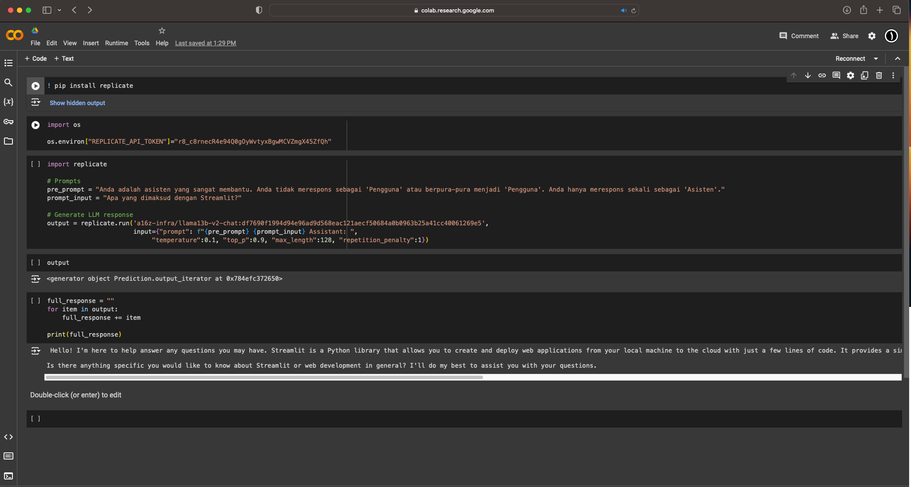

# Replicate API - The Llama 2 LLM in Python

&nbsp;

&nbsp;

### &#x1F530; Begin Project :

    ❯ pwd
        /Users/.../<project-name>

    ❯ cd <project-name>

    ❯ python -m venv venv

    ❯ source ./venv/bin/activate

    ❯ pip install -r requirements.txt

&nbsp;

&nbsp;

<pre>
    ❯ vim main.py

        import replicate
        import os

        os.environ["REPLICATE_API_TOKEN"]="r8_c8rnecR4e94Q0gOyWvtyxBgwMCVZmgX45ZfQh"

        # Prompts
        pre_prompt = "You are a helpful assistant. You do not respond as 'User' or pretend to be 'User'. You only respond once as 'Assistant'."
        prompt_input = "What is Streamlit?"

        # Generate LLM response
        output = replicate.run('a16z-infra/llama13b-v2-chat:df7690f1994d94e96ad9d568eac121aecf50684a0b0963b25a41cc40061269e5',
                            input={"prompt": f"{pre_prompt} {prompt_input} Assistant: ",
                                    "temperature":0.1, "top_p":0.9, "max_length":128, "repetition_penalty":1})

        full_response = ""
        for item in output:
            full_response += item

        print(full_response)
</pre>

&nbsp;

### &#x1F3C3; Run :
<pre>
    ❯ python3 main.py
    Hello! I'm here to help answer your questions. Streamlit is an open-source Python library that allows you to create and deploy web applications from your local machine to the cloud with just a few lines of code. It provides a simple and intuitive way to build web applications without the need for extensive knowledge of web development. With Streamlit, you can create interactive visualizations, gather user input, and perform machine learning tasks, all within a web application. It's a powerful tool for data scientists, engineers, and anyone else who wants to build web applications quickly and easily. Is there anything else you'
</pre>

&nbsp;

&nbsp;

&nbsp;

---

&nbsp;

## Results of running with Other Ways via Google Colab : 

&nbsp;

    

 

&nbsp;